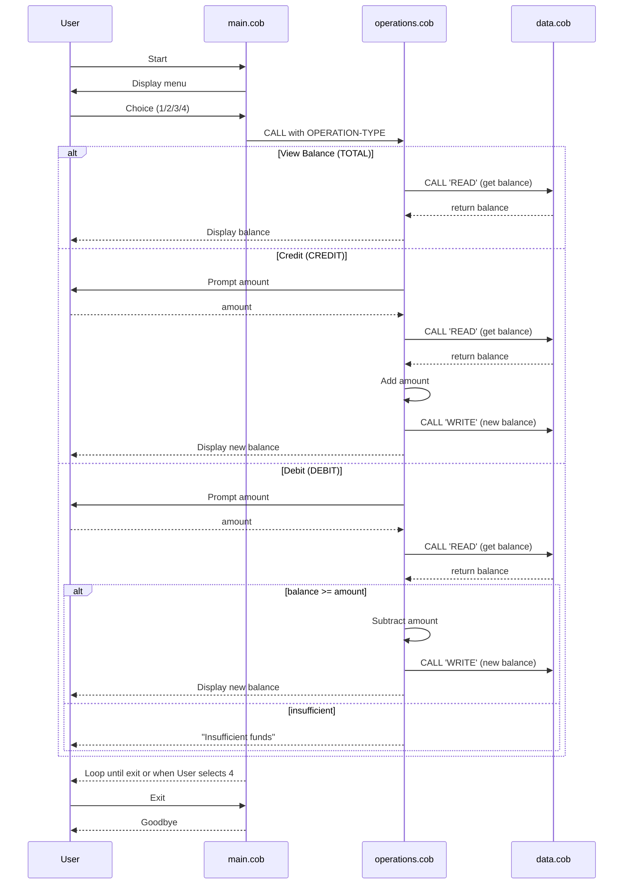

# COBOL Account Management System Documentation

This directory contains documentation for the COBOL programs in the repository. The project models a simple account management system with a hard-coded starting balance and three core operations.

---

## File Overview

### `main.cob`
- **Purpose**: Acts as the user interface and orchestrator for the system.
- **Key Functions**:
  - Displays a menu with options to view balance, credit, debit, or exit.
  - Accepts user input and dispatches requests to `Operations` via CALL statements.
  - Maintains a `CONTINUE-FLAG` to loop until the user chooses to exit.
- **Business Rules**:
  - Only accepts choices 1–4. Invalid entries prompt an error message.

### `operations.cob`
- **Purpose**: Implements the core transaction logic and interprets operation types.
- **Key Functions**:
  - Accepts a six-character operation code (`TOTAL `, `CREDIT`, `DEBIT `) via linkage.
  - On `TOTAL`, reads the current balance and displays it.
  - On `CREDIT`, prompts for an amount, reads the balance, adds the amount, writes the new balance, and shows the result.
  - On `DEBIT`, prompts for an amount and only performs the subtraction if funds are sufficient.
- **Business Rules**:
  - Prevents debits that exceed the available balance, displaying an "Insufficient funds" message.
  - All operations go through `DataProgram` for persistence of the balance.

### `data.cob`
- **Purpose**: Acts as a simple data store for the account balance.
- **Key Functions**:
  - Maintains `STORAGE-BALANCE` as a working-storage variable initialized to `1000.00`.
  - Supports two operations via linkage parameters:
    - `READ`: returns the current storage balance to the caller.
    - `WRITE`: updates the storage balance with a value passed in.
- **Business Rules**:
  - The balance is only modified by explicit `WRITE` calls from `operations.cob`.
  - No validation is performed here; that is handled by the caller.

## Business Rules Summary

1. **Starting Balance**: Accounts start at `1000.00` (hard-coded in `data.cob`).
2. **Operation Codes**: The system uses fixed 6-character codes, padded with spaces for `TOTAL` and `DEBIT` to match the PIC size.
3. **Debit Validation**: A debit request must not exceed the current balance; otherwise the transaction is refused.
4. **Single User Flow**: The system runs in a loop until the user explicitly selects the exit option.

---

For additional development or modification, review the individual COBOL files in `src/cobol` and ensure any new rules are reflected both in code and documentation.

---

## Sequence Diagram

Below is a Mermaid sequence diagram illustrating the data flow between the user and the three COBOL programs:

